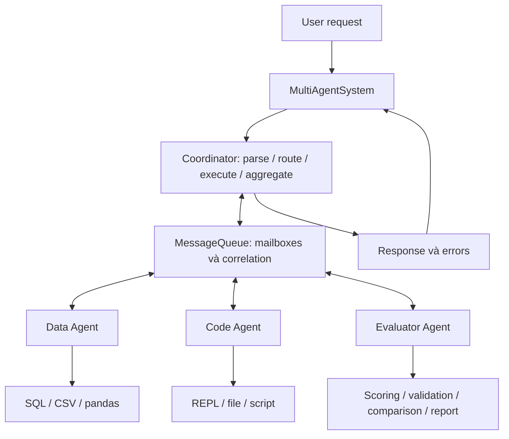
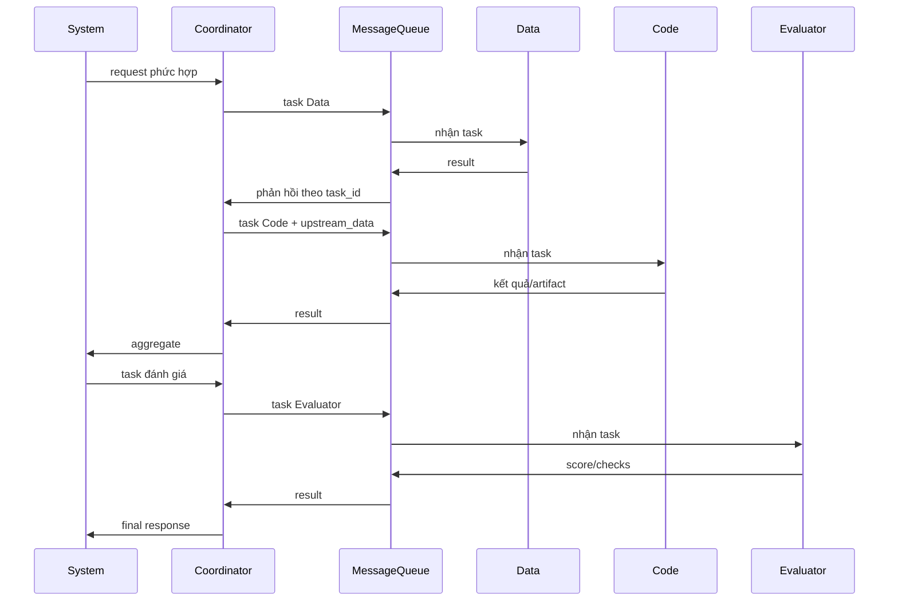

# Báo cáo Day 20: Multi-Agent Orchestration

Sinh viên: Phạm Anh Minh — MSSV: 2A202603009. Repo: https://github.com/map1509/K4-DAY20-MULTIAGENTS-PhamAnhMinh-2A202603009

Môi trường kiểm chứng: Windows, Python 3.11.9, venv, Deep Agents 0.7.21; mô hình gpt-4o-mini, temperature 0. Ngày đo: 06/10/2026. Không ghi API key.

## 1. Tổng quan bài lab

Bài toán là nhận yêu cầu, phân chia công việc cho các agent chuyên môn, chạy tools và tổng hợp kết quả. Phạm vi gồm CSV/SQLite, tạo/chạy Python, biểu đồ/báo cáo và đánh giá. Mục tiêu là pipeline async có guardrails, trace, tests và benchmark kiểm chứng được.

Trả lời ba câu hỏi kiến trúc:

1. Có 4 agent chính: Coordinator phân loại/định tuyến/tổng hợp; Data Agent phân tích dữ liệu; Code Agent tạo và thực thi code; Evaluator kiểm tra, chấm điểm và feedback.
2. Coordinator giao tiếp qua MessageQueue; worker nhận task và gửi result về coordinator. task_id và in_reply_to ghép đúng phản hồi với yêu cầu đồng thời.
3. Dùng chung giao diện BaseTool, workspace validation, logger và protocol. Tools chuyên môn cấp riêng: Data có SQL/CSV/pandas; Code có REPL/file/script; Evaluator có scoring/validation/comparison/report.

Repo còn có harness Deep Agents trong src/lab với explorer/implementer/reviewer, runner và curator. Đã hoàn thành TODO liên quan để test repo pass; đây là luồng riêng, không gộp với hệ thống bốn agent được benchmark.

## 2. Kiến trúc design



Coordinator quản lý workers và active tasks. BaseWorker cung cấp prompt, model/tool loop và structured output. Queue giữ mailbox trong một process. System gọi evaluator sau khi tổng hợp nếu cần; logs riêng từng component và communication JSONL hỗ trợ trace.



Protocol task thực tế (IDs/timestamp minh họa):

```json
{
  "type": "task",
  "task_id": "request-1-task-1",
  "content": {"request": "Analyze sales.csv"},
  "parameters": {},
  "from": "coordinator",
  "to": "data_agent",
  "timestamp": "2026-10-06T00:00:00+00:00",
  "id": "message-1"
}
```

Result có type=result, cùng task_id, in_reply_to=message-1 và trường result. Queue tạo UUID/timestamp UTC; timeout nằm ở API thực thi/receive. Batch độc lập chạy song song; workflow phụ thuộc dữ liệu chạy Data trước Code.

## 3. Implementation details

| Thành phần | Quyết định | Trade-off |
|---|---|---|
| Coordinator | Mapping/JSON/text; quy tắc cho task tường minh, model cho phần khác | Không bao phủ hết ngôn ngữ tự nhiên |
| BaseWorker | AIMessage/ToolMessage, tools theo task, 10 lượt tool calls, chặn lặp | Vẫn cần timeout provider |
| Async | gather/deadline/cancellation; đồng bộ qua thread | Hủy await không dừng thread đang chạy |
| Queue | asyncio.Queue và correlation IDs | Không persistent/distributed |
| Database | SQLite read-only, SELECT, parameters, connection cache/RLock | Query cùng connection tuần tự |
| REPL | Subprocess giữ state, AST/import restrictions, resource limits | Không phải sandbox OS cho code đối kháng |
| Code/file | Workspace-relative, AST; gộp tạo/chạy script | Chỉ chạy code tin cậy |
| Evaluation | Tools scoring/validation; mặc định kiểm tra output presence | Không chứng minh đúng nội dung |

SQL lấy tối đa 1.000 rows, trả chi tiết 100 rows; progress handler giới hạn lượng công việc. REPL mặc định timeout 30s, memory limit 1.024 MiB, output 10.000 ký tự. close() giải phóng REPL/connection. Logging che secret.

Harness gốc dùng backend Windows với Git Bash có sẵn và environment được lọc; runner tạo sandbox tạm ngoài repo, ghi usage/trace/điểm và phát hiện sửa skills. Curator chỉ đọc learning failures, bỏ skill không hợp lệ hoặc có evaluation markers. Không sửa các module PROVIDED/hằng prompt gốc.

## 4. Test results

Sau bonus, kiểm tra ngày 07/10/2026: **73/73 passed**, không skip. Statement coverage toàn src: **81,94%**, 1.307/1.595 statements.

| Nhóm | Passed |
|---|---|
| Coordinator | 14/14 |
| Workers | 4/4 |
| Tools | 4/4 |
| BaseWorker | 7/7 |
| Integration/E2E/performance/regression | 8/8 |
| Provided/agent/runner/curator gốc | 32/32 |
| Bonus caching | 4/4 |
| Tổng | 73/73 |

Integration kiểm tra coordinator-worker-tool, full pipeline, latency local và 10 yêu cầu đồng thời. Regression kiểm tra tạo/chạy script một lượt model, routing với offline workers và che secret trong log.

Error cases gồm timeout/cleanup, retry exhaustion, invalid model response, worker output sai, giới hạn task giữa batch đồng thời và cancellation; xem tests/test_02_coordinator.py. Tools được kiểm tra ở tests/test_04_tools.py.

```powershell
.venv\Scripts\python.exe -m pytest tests/ -o addopts='-p no:cacheprovider' -q --tb=short --cov=src --cov-report=term-missing --cov-report=json:results/coverage.json
```

Suite trước bonus có coverage mất 54,66s; chưa lưu thời gian tổng lần chạy bonus. Không loại module khỏi mẫu số; REPL subprocess chưa instrument nên _repl_worker.py ghi 0%. Coverage dòng không chứng minh hết mọi nhánh. Báo cáo chi tiết mới nhất: results/coverage.json.

## 5. Performance analysis

Benchmark thật gồm 3 task × 3 lần tuần tự; CSV doanh thu 100+150+250=500. Kết quả: benchmark_results.json; metrics: results/benchmark/ba372709-4f7d-483e-8ef2-140ec36541ef/metrics.json.

| Test case | Min | Max | Avg | Median | Success |
|---|---|---|---|---|---|
| Simple data query | 0,901s | 2,061s | 1,327s | 1,019s | 3/3 |
| Code generation | 5,875s | 6,483s | 6,095s | 5,928s | 3/3 |
| Complex workflow | 3,129s | 6,794s | 4,450s | 3,429s | 3/3 |

| Metric | Trước tối ưu | Sau tối ưu | Target |
|---|---|---|---|
| P50 | 6,688s | 3,429s | <5s |
| P99 nội suy | 10,295s | 6,769s | <15s |
| Successful throughput | 9,816/phút | 15,159/phút | >10/phút |
| Error rate | 0/9 | 0/9 | <1% |
| Token usage | 17.021 | 4.147 | Theo dõi |
| Token/100 dự phóng | 189.122 | 46.078 | ≤150.000 |

Sau tối ưu: 3.156 input + 991 output tokens, giảm khoảng 75,6%. Đạt các mục trong mẫu; chín requests chưa đủ xác nhận P99/error rate dài hạn. Dự phóng không phải đo 100 requests.

Code generation chậm nhất, trung bình 6,095s gồm sinh code và chạy kiểm tra. Biểu đồ lần đầu 6,794s, sau đó 3,429s và 3,129s; chưa tách timing để quy toàn bộ cho REPL startup. cProfile main thread chủ yếu chờ event-loop/I/O, không đo CPU threads/subprocess. Chưa đo RSS/CPU toàn hệ thống; memory limit không phải memory usage.

Tối ưu thực hiện: giảm lượt model phân loại, lọc tool schemas theo task, gộp tạo/chạy script, kết thúc ở tool output đã kiểm chứng, cache secret list khi configure logging. Chưa triển khai result caching.

## 6. Error analysis & resilience

| Lỗi | Xử lý thực tế | Giới hạn |
|---|---|---|
| Worker timeout | Deadline/cancel/await, record timeout | Thread có thể tiếp tục |
| Worker exception | Log/record error, giữ partial results | Chưa tự fallback worker |
| Invalid input/output | Validate trước routing/thực thi và worker results | Không chấm mọi thuộc tính nội dung |
| Resource exhaustion | Tối đa 32 active tasks, kiểm tra giữa batch | Queue/history chưa bounded |
| Retry | Opt-in, chỉ task lỗi; mặc định 2 retry ngoài lần đầu | Chưa có backoff/circuit breaker; chú ý side effects |
| Tool failure | Validation và structured error/exception | Guardrails không thay isolation OS |
| Pipeline deadline | wait_for và trả timeout | Không đảm bảo giữ partial results khi deadline toàn pipeline hết |

Benchmark đầu 6/9 vì Code ghi đè PNG bằng file văn bản rỗng dù pipeline báo success. Validator phát hiện ảnh sai; sửa prompt, tool selection và điều kiện kết thúc. Kết quả lỗi giữ ở results/benchmark/fad603a5-7c47-44fe-b238-51a6d32fc86a/.

Queue không drop-oldest hoặc có test overflow giả định. Ứng dụng chưa có policy rate-limit backoff riêng; không tự chấm resilience score khi chưa có rubric. Debug scripts: scripts/debug_agent.py và scripts/debug_system.py.

## 7. Comparison: design vs implementation

| Yêu cầu | Thực tế | Đánh giá |
|---|---|---|
| Coordinator + 3 workers | Đủ bốn vai trò và tools riêng | Đạt |
| Async communication | Mailboxes/correlation/gather/deadline | Một process |
| Collaboration | Data → Code với upstream_data → Evaluator | Phần phụ thuộc tuần tự |
| 23+ tests, all pass | 73/73 | Đạt |
| Coverage >80% | 81,94% | Đạt statement coverage |
| Latency/throughput/token | Mục 5 | Đạt trong mẫu |
| Utilization mỗi worker 70–90% | Data 47,031%; Code 62,345%; Evaluator 0,102% | Chưa đạt |
| Python sandbox | Subprocess/resource/AST limits | Chưa isolation OS |

Protocol correlation và structured outputs hỗ trợ debug đồng thời. Khó khăn chính là tool selection và false success khi artifacts sai. Bài học: kiểm tra output thật, giữ trace, phân biệt pipeline status với chất lượng nội dung.

## 8. Scalability analysis

Đo workload báo cáo riêng: 10 requests, concurrency=3, **10/10 success**, P50 **2,550s**, P99 **2,917s**, **58,968 req/phút**, 6.561 tokens; dự phóng **65.610/100 requests**. Metrics: results/profiling/d0bfca29-926b-4f8d-b991-4b4dc80549d0/metrics.json. Không thay số liệu workload biểu đồ ở mục 5.

Utilization tính phần thời gian có ít nhất một call đang active bằng hợp các khoảng thời gian, tránh cộng chồng vượt 100%; gồm model/I/O waits, không phải CPU/capacity usage. Evaluator deterministic rất ngắn; tăng concurrency chung không cân bằng thời lượng giai đoạn. Không kéo dài tác vụ để nâng tỷ lệ.

Scale ngang cần broker ngoài process, worker replicas, persistent task state và idempotency trước retry. Coordinator hiện là điểm đơn; mỗi tên worker có một instance. SQL connection/REPL có lock có thể giới hạn throughput. Task lớn cần pagination/streaming; pandas/CSV vẫn có thể đọc toàn file. Cần admission control và tải dài hạn trước khi kết luận về quota API hoặc nhiều máy.

## 9. Hạn chế & cân nhắc

1. Mẫu nhỏ: 9 benchmark/10 profile requests, chưa xác nhận SLA/error rate dài hạn.
2. Validator kiểm tra sum=500, script tồn tại/AST, PNG signature và evaluation; chưa chấm nội dung hình hoặc mọi tính chất script. Evaluator mặc định chỉ kiểm tra output presence.
3. REPL globals/workspace dùng chung; concurrency cần artifact names riêng, chưa có isolation theo người dùng.
4. AST/subprocess không bảo mật cho code đối kháng. LocalShellBackend gốc có quyền host, phù hợp code tin cậy của lab.
5. Queue/history memory chưa bounded; chưa phục hồi task khi crash. File logs không thay persistent task state.
6. Chưa đo RSS/CPU; utilization mục tiêu chưa đạt; coverage không instrument REPL subprocess.

## 10. Kết luận & đề xuất tiếp theo

Đã xây dựng Coordinator/Data/Code/Evaluator với tools và giao tiếp async, kiểm chứng 73/73 tests và coverage 81,94% sau bonus 6c. Benchmark LLM đạt 9/9 cùng mục tiêu P50/P99/throughput/token trong mẫu; caching local đạt 19 hit/1 miss cho 20 requests. Utilization 70–90% cho mọi worker chưa đạt do workload và thời lượng không cân bằng. Tiếp theo cần validation nội dung artifacts, tải dài hạn và queue/state có giới hạn. Triển khai ngoài lab cần isolation mạnh hơn, broker persistent và idempotency.

## Phụ lục: checklist nộp bài

```powershell
.venv\Scripts\python.exe -m pytest tests/ -v
.venv\Scripts\python.exe scripts/test_coordinator_standalone.py
.venv\Scripts\python.exe scripts/benchmark.py
.venv\Scripts\python.exe scripts/profile_system.py --live --requests 10 --concurrency 3
```

- [x] Phần 0: fork/clone, venv/dependencies, .env không commit; đọc README và GUIDE (repo không có LAB_GUIDE.md).
- [x] Phần 1: sơ đồ, roles, protocol và ba câu hỏi mục 1.
- [x] Phần 2–4: coordinator, workers, queue, SQL/REPL/file/evaluation tools.
- [x] Phần 5: 23+ tests/all pass, coverage, benchmarks và phân tích.
- [x] Phần 6: đủ 10 mục báo cáo theo yêu cầu mới nhất.
- [x] Bonus 6c: Result Caching, có kiểm tra invalidation/TTL/bounds và benchmark local.
- [x] Push GitHub: đã push branch main tới origin; bản báo cáo hoàn thiện ở commit 7b42dc1.
- [ ] Submit: sinh viên sẽ tự nộp sau.

Test/performance ở mục 4–5 theo Phần 6; mục 6 là resilience. Lịch sử debug/profiling ở report/INTEGRATION.md. Không dùng số liệu ví dụ của đề bài làm kết quả đo.

### Bonus 6c: Result Caching (07/10/2026)

`CachingCoordinator` trong `src/coordinator.py` kế thừa Coordinator và cung cấp cùng API `handle_request`. Cache chỉ áp dụng cho yêu cầu có cấu trúc `data_analysis` với operation `analyze_csv`, `pandas_analysis` hoặc `csv_parser` và nguồn CSV. Task tạo/sửa file, thực thi Python, SQL, text không có kế hoạch tường minh và kết quả lỗi đều không được cache.

Key gồm request, đường dẫn workspace, SHA-256 nội dung CSV và worker/model identity. Hash lại sau khi xử lý để không lưu kết quả nếu file đã đổi. TTL mặc định 60s, tối đa 32 entries với LRU; có `clear_cache()`. Kết quả được deep-copy để caller không làm hỏng cache; `cache.hit` và `cache_stats` cho biết hit/miss/bypass. Cache hit giữ timestamp/task records của lần tính gốc; không giả lập một lần thực thi mới. Deadline bao phủ cả bước hash. Cache chưa persistent và concurrent misses có thể đọc trùng.

```python
from agents import DataAgent
from coordinator import CachingCoordinator

coordinator = CachingCoordinator(
    worker_agents=[DataAgent(workspace="workspace")],
    cache_ttl=60, cache_max_entries=32,
)
request = {"task_type": "data_analysis", "parameters": {
    "operation": "analyze_csv", "path": "sales.csv", "column": "revenue"}}
# Trong async function:
# first = await coordinator.handle_request(request)
# second = await coordinator.handle_request(request)  # cache.hit=True nếu CSV chưa đổi
```

Benchmark chạy `scripts/benchmark_cache.py`, 20 yêu cầu/mode trên CSV 10.000 rows, **không gọi LLM**, có cả cold miss đầu tiên:

| Metric | Không cache | Có cache |
|---|---|---|
| Tổng thời gian | 0,309581s | 0,032686s |
| Trung bình/request | 15,479ms | 1,634ms |
| Task messages tới worker | 20 | 1 |
| Cache hit/miss | Không áp dụng | 19/1 |

Giảm khoảng 89,4% thời gian trong mẫu local. Không so throughput local này với benchmark LLM hoặc khẳng định token savings chưa đo. Metrics: `results/caching/8ea43209-9b5e-4215-8d5d-526cc9970127/metrics.json`. Tests: `tests/test_06_caching.py` kiểm tra copy isolation, file invalidation, TTL/LRU, error/write bypass và deadline/config validation.

Utilization 70–90% của từng worker vẫn chưa đạt trong workload đã đo ở mục 8. Đây là mục tiêu phụ thuộc phân bố tải và định nghĩa capacity, không phải TODO chưa cài; caching giảm công việc worker nên cũng không bảo đảm nâng tỷ lệ này. Không thêm sleep hay công việc không cần thiết để làm đẹp số. Bước Submit vẫn do sinh viên tự thực hiện như đã yêu cầu.
