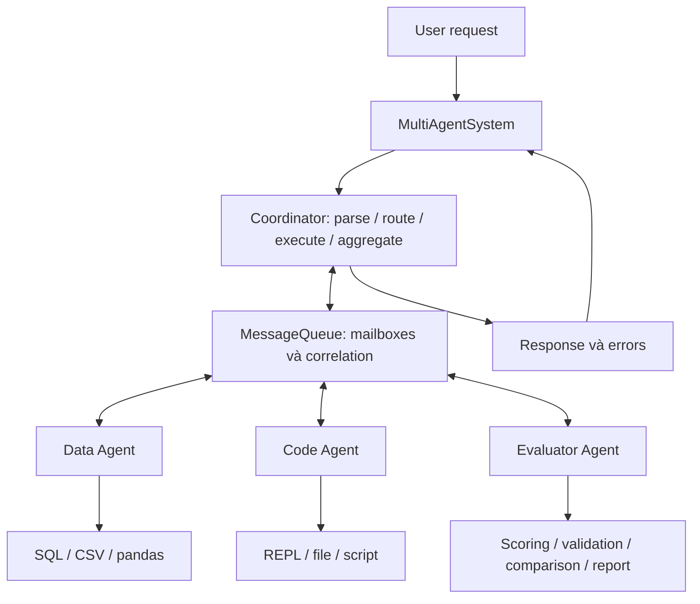
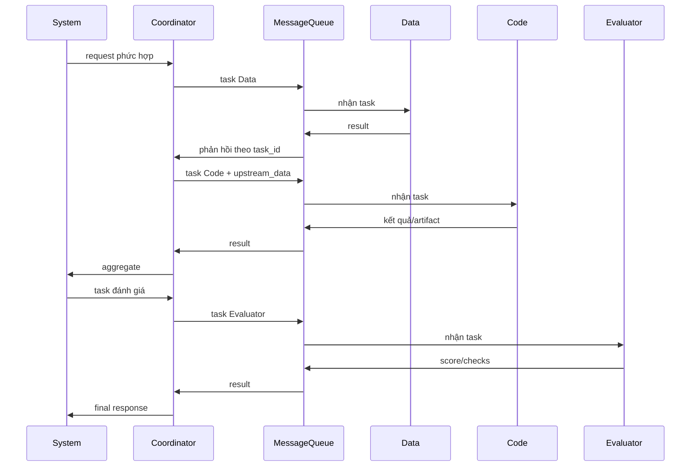

# Báo cáo Lab: Self evolving Agentic

## 1. Thông tin nhóm và cấu hình

| Họ tên | Mã sinh viên | Phần đóng góp |
|---|---|---|
| Phạm Anh Minh | 2A202603009 | Cài harness Deep Agents, coordinator/workers/tools, tests, benchmark và báo cáo |

- Nhà cung cấp và mô hình (`LAB_MODEL`, không ghi khóa API), nhiệt độ (`LAB_TEMPERATURE`), `recursion_limit`: mô hình gpt-4o-mini qua cấu hình endpoint trong .env; temperature 0; runner mặc định recursion_limit=60. Tests có thể dùng model giả và giới hạn riêng.
- Phiên bản Deep Agents (`pip show deepagents`), hệ điều hành, chạy trực tiếp hay trong Docker: Deep Agents 0.7.21; Windows; Python 3.11.9 trong .venv; chạy trực tiếp.
- Số lần chạy tác vụ đã dùng / ngân sách: chưa có run chính thức được lưu cho ba điều kiện baseline/subagents/skills-auto; chưa tổng hợp ngân sách toàn phiên. Benchmark hệ thống multi-agent riêng có 9 requests/lần; không coi đây là các tác vụ Deep Agents của template.
- Commit của tag `freeze`: chưa có tag freeze. Không tạo tag hồi tố để coi giả thuyết là đã đăng ký trước.

## 2. Giả thuyết (commit TRƯỚC tag `freeze`, Phần 4.0)

Các giả thuyết dưới đây chưa được kiểm chứng bằng thí nghiệm ba điều kiện. Chưa có freeze nên chưa đáp ứng bước đóng băng/đánh giá trong GUIDE; không suy luận kết quả từ unit tests. Căn cứ thiết kế: guides/pseudocode/01_agent.md, 02_subagents.md và 04_curator.md.

- H1 (subagents so với baseline): subagents có thể cải thiện kiểm tra kỹ thuật ở tác vụ nhiều bước nhờ chia việc khảo sát, thực hiện và review; dự kiến tăng token và thời gian do giao tiếp/kiểm tra kết quả.
- H2 (skills-auto so với baseline): skills-auto có thể giảm lỗi lặp lại khi skill mô tả quy trình tổng quát từ learning feedback; hiệu quả phụ thuộc skill được đọc và áp dụng, không chỉ được tạo.
- H3 (tác vụ học so với tác vụ đánh giá): cải thiện có thể lớn hơn trên learning tasks; chênh lệch nhỏ trên evaluation tasks sẽ cho thấy khả năng chuyển giao hạn chế hoặc skill quá riêng cho dữ liệu học.

## 3. Làm quen Deep Agents (Phần 0.3)

1. Đã đọc README.md, GUIDE.md và pseudo-code; repo không có LAB_GUIDE.md. Tour ngoại tuyến xác nhận 9 tools mặc định: ls, read_file, write_file, edit_file, delete, glob, grep, execute, task. File tools và shell dùng đường dẫn tương đối workspace/...; execute chạy từ sandbox root.
2. Subagent mặc định general-purpose nhận prompt giao việc và trả báo cáo cuối; không tự nhận toàn bộ lịch sử của agent chính. Harness đã thêm explorer để khảo sát, implementer để sửa/chạy checks và reviewer để kiểm tra; mỗi prompt được nối PATHS_NOTE.
3. Tour xác nhận system prompt mặc định rỗng, nhưng tool descriptions vẫn hướng dẫn hành vi. Harness dùng BASE_PROMPT được cung cấp, thêm SUBAGENTS_NOTE khi bật subagents, thêm SKILLS_NOTE và skills=["/skills/"] khi bật skills. Backend Windows dùng Git Bash với environment được lọc, không chuyển API keys vào shell.

## 4. Đường cơ sở và phân loại lỗi (Phần 2.2)

| Tác vụ | Check thất bại | Nhóm lỗi (A-G) | Bằng chứng (trích ngắn từ `detail` hoặc vết) |
|---|---|---|---|
| Chưa chạy baseline learning chính thức | Chưa có dữ liệu | Chưa phân loại | Không có results/baseline/<task>/run.json và trace.md |

Chưa xác định nhóm lỗi chiếm đa số hoặc kiểm chứng skill phòng ngừa nhóm đó. Lỗi routing/SQL-for-CSV/PNG overwrite của hệ thống multi-agent riêng được ghi ở phụ lục hệ thống multi-agent dưới đây và INTEGRATION.md; không gán chúng thành failed checks của các learning tasks trong template.

## 5. Điều kiện `subagents` (Phần 2.3)

- Các subagent đã định nghĩa (tên, vai trò, lý do thiết kế): explorer đọc và báo cáo constraints; implementer triển khai và chạy checks; reviewer kiểm tra độc lập. Định nghĩa tại src/lab/subagents.py; vai trò tách biệt giúp prompt giao việc rõ ràng.
- `subagent_calls` ở từng tác vụ và nhận xét (kể cả trường hợp bằng 0): chưa có số liệu chính thức theo task. Unit test xác nhận runner đếm tool calls tên task; không thay thế run thật.
- Thông tin thiếu hoặc thừa khi giao việc (nếu có giao việc): chưa phân tích trace thật. SUBAGENTS_NOTE yêu cầu gửi đủ rules và paths; PATHS_NOTE được thêm cho mỗi subagent để thống nhất đường dẫn.
- Ảnh hưởng đến token và thời gian: chưa đo baseline vs subagents. Runner cộng usage metadata cho cả subagents, trong khi trace/tool-call counts chỉ gồm luồng chính.

## 6. Self-evolving: skill do curator sinh (Phần 3)

- Số lần chạy curator, số skill bị xóa và lý do: chưa chạy curator bằng LLM trên learning results chính thức; chưa có bộ skills/auto để đóng băng. Curator đã được unit test với model giả: chỉ đọc learning failures, bỏ skill sai tên/path traversal và skill chứa evaluation markers.

| Skill | Tổng quát hay riêng cho tác vụ học? | Đúng hay sai (nêu chỗ sai nếu có) | Độ dài, `description` và `skills_read` ở Phần 3.4 |
|---|---|---|---|
| Chưa có skill sinh từ learning runs chính thức | Chưa đánh giá | Chưa đánh giá | Chưa có measurements |

Skill synthetic trong tests không được đưa vào bảng như một skill chính thức. Chưa đo việc đọc skill hoặc khả năng chuyển giao sang evaluation tasks.

## 7. Kết quả so sánh (Phần 4.3, 4.4)

Chạy lab.compare trên dữ liệu hiện có không có cột điều kiện hoặc hàng tác vụ vì chưa có run.json chính thức. Nội dung report/table.md do công cụ sinh:

```text
| Task |  |
|---|
| **Mean score - learning tasks** |  |
| **Mean score - evaluation tasks** |  |
| **Mean tokens per run** |  |
| **Runs that read a skill** |  |
```

Kết quả scripts/check_breakdown.py:

```text
condition     role    technical  house rules  mean tokens  read a skill
(evaluation rows are hidden until the git tag `freeze` exists)
```

Không có run chính thức để thống kê error hoặc skills_modified=true; điều này không có nghĩa đã chạy và không lỗi. Chưa chạy evaluation vì chưa có tag freeze. Kết quả benchmark của Coordinator/Data/Code/Evaluator không được dùng thay bảng so sánh này.

## 8. Phân tích

1. **Baseline vs subagents/skills-auto trên learning/evaluation:** chưa có dữ liệu mục 7 nên chưa kết luận điều kiện nào cải thiện; chưa đánh giá dấu hiệu chỉ tốt trên learning.
2. **Checks kỹ thuật và rule_:** chưa có breakdown theo điều kiện; chưa xác định skill hỗ trợ nhóm nào hoặc rule mới trên evaluation. Công cụ check_breakdown.py phân nhóm bằng prefix rule_.
3. **Skill giúp/không giúp:** chưa có trace và skills_read từ runs chính thức để chọn ví dụ. Cần kiểm tra read_file của SKILL.md rồi đối chiếu hành động và failed checks.
4. **Chi phí:** chưa có token trung bình/điểm theo ba điều kiện nên chưa tính hiệu quả điểm/token hoặc kết luận lợi ích đa tác tử. Benchmark riêng dùng 4.147 tokens/9 requests, không phải phép so sánh baseline/subagents/skills-auto.
5. **Rò rỉ/quá khớp:** curator lọc role=learn và validate_skill chặn evaluation markers; tests kiểm tra các guardrails này. Chưa có bộ skill sinh thật để đánh giá nội dung hoặc overfitting.
6. **Nhiễu trước/sau freeze:** chưa có snapshot skills, tag freeze hoặc paired runs nên chưa tính chênh lệch. Cần cùng bộ skill, cấu hình và tác vụ rồi lưu hai lần chạy để đối chiếu.

## 9. Hạn chế và tính hợp lệ

1. Thí nghiệm đúng protocol của template chưa được chạy; unit tests pass không chứng minh giả thuyết hoặc điểm evaluation.
2. Không có freeze và bảng so sánh ba điều kiện; không thể kết luận chuyển giao, overfitting hoặc hiệu quả điểm/token.
3. Benchmark multi-agent riêng chỉ có 9 mẫu/lần và profile 10 requests, không đủ xác nhận P99/error rate dài hạn. Utilization 70–90% cho mỗi worker vẫn chưa đạt trong workload đã đo.
4. REPL/LocalShellBackend không phải isolation OS cho code đối kháng. Coverage không instrument REPL subprocess; statement coverage không thay kiểm tra mọi nhánh.
5. Evaluator của hệ thống riêng mặc định kiểm tra output presence; validator benchmark chưa chấm toàn bộ nội dung artifacts.

## 10. Kết luận

Đã cài harness và hệ thống multi-agent riêng, kiểm chứng 74/74 tests cùng statement coverage 82,40%. Báo cáo này tuân theo template gốc và ghi rõ dữ liệu thí nghiệm còn thiếu. Chưa thể kết luận baseline, subagents hay skills-auto tốt hơn khi chưa có các runs đúng protocol. Bước tiếp theo là chạy learning tasks, sinh/kiểm tra skills, đăng ký giả thuyết trước freeze rồi mới chạy evaluation và so sánh.

## Phụ lục

- Lệnh đã chạy (theo thứ tự của lần rà soát template): git tag --list; kiểm tra files results/skills; python -m lab.compare; python scripts/check_breakdown.py. Các lần kiểm chứng trước gồm pytest tests/, standalone coordinator, communication và tool integration; chi tiết ở phụ lục hệ thống multi-agent dưới đây.
- Thử thách mở rộng (nếu có): bonus 6c Result Caching cho hệ thống Coordinator riêng; TTL/LRU, SHA-256 invalidation, không cache writes/errors. Benchmark local 20 requests đạt 19 hit/1 miss, task messages giảm 20→1, thời gian trung bình giảm 15,479ms→1,634ms; không suy ra LLM throughput hoặc token savings từ số này.
- Ghi chú khác: nội dung báo cáo multi-agent được gộp vào phụ lục bên dưới, gồm architecture, protocol, tests, live benchmark và checklist. report/REPORT.md hiện theo đúng REPORT_TEMPLATE.md. Không ghi API key, không tạo số liệu hoặc freeze hồi tố. Submit vẫn do sinh viên tự thực hiện.

### Hệ thống multi-agent: kiến trúc, kết quả và bonus

Nội dung sau ghi lại hệ thống Coordinator/Data/Code/Evaluator riêng, không thay dữ liệu thí nghiệm baseline/subagents/skills-auto của template.

Sinh viên: Phạm Anh Minh — MSSV: 2A202603009. Repo: https://github.com/map1509/K4-DAY20-MULTIAGENTS-PhamAnhMinh-2A202603009

Môi trường kiểm chứng: Windows, Python 3.11.9, venv, Deep Agents 0.7.21; mô hình gpt-4o-mini, temperature 0. Ngày đo: 06/10/2026. Không ghi API key.

#### 1. Tổng quan bài lab

Bài toán là nhận yêu cầu, phân chia công việc cho các agent chuyên môn, chạy tools và tổng hợp kết quả. Phạm vi gồm CSV/SQLite, tạo/chạy Python, biểu đồ/báo cáo và đánh giá. Mục tiêu là pipeline async có guardrails, trace, tests và benchmark kiểm chứng được.

Trả lời ba câu hỏi kiến trúc:

1. Có 4 agent chính: Coordinator phân loại/định tuyến/tổng hợp; Data Agent phân tích dữ liệu; Code Agent tạo và thực thi code; Evaluator kiểm tra, chấm điểm và feedback.
2. Coordinator giao tiếp qua MessageQueue; worker nhận task và gửi result về coordinator. task_id và in_reply_to ghép đúng phản hồi với yêu cầu đồng thời.
3. Dùng chung giao diện BaseTool, workspace validation, logger và protocol. Tools chuyên môn cấp riêng: Data có SQL/CSV/pandas; Code có REPL/file/script; Evaluator có scoring/validation/comparison/report.

Repo còn có harness Deep Agents trong src/lab với explorer/implementer/reviewer, runner và curator. Đã hoàn thành TODO liên quan để test repo pass; đây là luồng riêng, không gộp với hệ thống bốn agent được benchmark.

#### 2. Kiến trúc design



Coordinator quản lý workers và active tasks. BaseWorker cung cấp prompt, model/tool loop và structured output. Queue giữ mailbox trong một process. System gọi evaluator sau khi tổng hợp nếu cần; logs riêng từng component và communication JSONL hỗ trợ trace.



Protocol task thực tế (IDs/timestamp minh họa):

```json
{
  "type": "task",
  "task_id": "request-1-task-1",
  "content": {"request": "Analyze sales.csv"},
  "parameters": {},
  "from": "coordinator",
  "to": "data_agent",
  "timestamp": "2026-10-06T00:00:00+00:00",
  "id": "message-1"
}
```

Result có type=result, cùng task_id, in_reply_to=message-1 và trường result. Queue tạo UUID/timestamp UTC; timeout nằm ở API thực thi/receive. Batch độc lập chạy song song; workflow phụ thuộc dữ liệu chạy Data trước Code.

#### 3. Implementation details

| Thành phần | Quyết định | Trade-off |
|---|---|---|
| Coordinator | Mapping/JSON/text; quy tắc cho task tường minh, model cho phần khác | Không bao phủ hết ngôn ngữ tự nhiên |
| BaseWorker | AIMessage/ToolMessage, tools theo task, 10 lượt tool calls, chặn lặp | Vẫn cần timeout provider |
| Async | gather/deadline/cancellation; đồng bộ qua thread | Hủy await không dừng thread đang chạy |
| Queue | asyncio.Queue và correlation IDs | Không persistent/distributed |
| Database | SQLite read-only, SELECT, parameters, connection cache/RLock | Query cùng connection tuần tự |
| REPL | Subprocess giữ state, AST/import restrictions, resource limits | Không phải sandbox OS cho code đối kháng |
| Code/file | CreateFileTool và EditFileTool riêng; workspace-relative, AST; gộp tạo/chạy script | Chỉ chạy code tin cậy |
| Evaluation | Tools scoring/validation; mặc định kiểm tra output presence | Không chứng minh đúng nội dung |

SQL lấy tối đa 1.000 rows, trả chi tiết 100 rows; progress handler giới hạn lượng công việc. REPL mặc định timeout 30s, memory limit 1.024 MiB, output 10.000 ký tự. close() giải phóng REPL/connection. Logging che secret.

Harness gốc dùng backend Windows với Git Bash có sẵn và environment được lọc; runner tạo sandbox tạm ngoài repo, ghi usage/trace/điểm và phát hiện sửa skills. Curator chỉ đọc learning failures, bỏ skill không hợp lệ hoặc có evaluation markers. Không sửa các module PROVIDED/hằng prompt gốc.

#### 4. Test results

Sau bonus và bổ sung EditFileTool, kiểm tra ngày 07/10/2026: **74/74 passed**, không skip. Statement coverage toàn src: **82,40%**, 1.339/1.625 statements.

| Nhóm | Passed |
|---|---|
| Coordinator | 14/14 |
| Workers | 4/4 |
| Tools | 5/5 |
| BaseWorker | 7/7 |
| Integration/E2E/performance/regression | 8/8 |
| Provided/agent/runner/curator gốc | 32/32 |
| Bonus caching | 4/4 |
| Tổng | 74/74 |

Integration kiểm tra coordinator-worker-tool, full pipeline, latency local và 10 yêu cầu đồng thời. Regression kiểm tra tạo/chạy script một lượt model, routing với offline workers và che secret trong log.

Error cases gồm timeout/cleanup, retry exhaustion, invalid model response, worker output sai, giới hạn task giữa batch đồng thời và cancellation; xem tests/test_02_coordinator.py. Tools được kiểm tra ở tests/test_04_tools.py.

```powershell
.venv\Scripts\python.exe -m pytest tests/ -o addopts='-p no:cacheprovider' -q --tb=short --cov=src --cov-report=term-missing --cov-report=json:results/coverage.json
```

Suite trước bonus có coverage mất 54,66s; chưa lưu thời gian tổng lần chạy bonus. Không loại module khỏi mẫu số; REPL subprocess chưa instrument nên _repl_worker.py ghi 0%. Coverage dòng không chứng minh hết mọi nhánh. Báo cáo chi tiết mới nhất: results/coverage.json.

#### 5. Performance analysis

Benchmark thật gồm 3 task × 3 lần tuần tự; CSV doanh thu 100+150+250=500. Kết quả: benchmark_results.json; metrics: results/benchmark/ba372709-4f7d-483e-8ef2-140ec36541ef/metrics.json.

| Test case | Min | Max | Avg | Median | Success |
|---|---|---|---|---|---|
| Simple data query | 0,901s | 2,061s | 1,327s | 1,019s | 3/3 |
| Code generation | 5,875s | 6,483s | 6,095s | 5,928s | 3/3 |
| Complex workflow | 3,129s | 6,794s | 4,450s | 3,429s | 3/3 |

| Metric | Trước tối ưu | Sau tối ưu | Target |
|---|---|---|---|
| P50 | 6,688s | 3,429s | <5s |
| P99 nội suy | 10,295s | 6,769s | <15s |
| Successful throughput | 9,816/phút | 15,159/phút | >10/phút |
| Error rate | 0/9 | 0/9 | <1% |
| Token usage | 17.021 | 4.147 | Theo dõi |
| Token/100 dự phóng | 189.122 | 46.078 | ≤150.000 |

Sau tối ưu: 3.156 input + 991 output tokens, giảm khoảng 75,6%. Đạt các mục trong mẫu; chín requests chưa đủ xác nhận P99/error rate dài hạn. Dự phóng không phải đo 100 requests.

Code generation chậm nhất, trung bình 6,095s gồm sinh code và chạy kiểm tra. Biểu đồ lần đầu 6,794s, sau đó 3,429s và 3,129s; chưa tách timing để quy toàn bộ cho REPL startup. cProfile main thread chủ yếu chờ event-loop/I/O, không đo CPU threads/subprocess. Chưa đo RSS/CPU toàn hệ thống; memory limit không phải memory usage.

Tối ưu thực hiện: giảm lượt model phân loại, lọc tool schemas theo task, gộp tạo/chạy script, kết thúc ở tool output đã kiểm chứng, cache secret list khi configure logging. Chưa triển khai result caching.

#### 6. Error analysis & resilience

| Lỗi | Xử lý thực tế | Giới hạn |
|---|---|---|
| Worker timeout | Deadline/cancel/await, record timeout | Thread có thể tiếp tục |
| Worker exception | Log/record error, giữ partial results | Chưa tự fallback worker |
| Invalid input/output | Validate trước routing/thực thi và worker results | Không chấm mọi thuộc tính nội dung |
| Resource exhaustion | Tối đa 32 active tasks, kiểm tra giữa batch | Queue/history chưa bounded |
| Retry | Opt-in, chỉ task lỗi; mặc định 2 retry ngoài lần đầu | Chưa có backoff/circuit breaker; chú ý side effects |
| Tool failure | Validation và structured error/exception | Guardrails không thay isolation OS |
| Pipeline deadline | wait_for và trả timeout | Không đảm bảo giữ partial results khi deadline toàn pipeline hết |

Benchmark đầu 6/9 vì Code ghi đè PNG bằng file văn bản rỗng dù pipeline báo success. Validator phát hiện ảnh sai; sửa prompt, tool selection và điều kiện kết thúc. Kết quả lỗi giữ ở results/benchmark/fad603a5-7c47-44fe-b238-51a6d32fc86a/.

Queue không drop-oldest hoặc có test overflow giả định. Ứng dụng chưa có policy rate-limit backoff riêng; không tự chấm resilience score khi chưa có rubric. Debug scripts: scripts/debug_agent.py và scripts/debug_system.py.

#### 7. Comparison: design vs implementation

| Yêu cầu | Thực tế | Đánh giá |
|---|---|---|
| Coordinator + 3 workers | Đủ bốn vai trò và tools riêng | Đạt |
| Async communication | Mailboxes/correlation/gather/deadline | Một process |
| Collaboration | Data → Code với upstream_data → Evaluator | Phần phụ thuộc tuần tự |
| 23+ tests, all pass | 74/74 | Đạt |
| Coverage >80% | 82,40% | Đạt statement coverage |
| Latency/throughput/token | Mục 5 | Đạt trong mẫu |
| Utilization mỗi worker 70–90% | Data 47,031%; Code 62,345%; Evaluator 0,102% | Chưa đạt |
| Python sandbox | Subprocess/resource/AST limits | Chưa isolation OS |

Protocol correlation và structured outputs hỗ trợ debug đồng thời. Khó khăn chính là tool selection và false success khi artifacts sai. Bài học: kiểm tra output thật, giữ trace, phân biệt pipeline status với chất lượng nội dung.

#### 8. Scalability analysis

Đo workload báo cáo riêng: 10 requests, concurrency=3, **10/10 success**, P50 **2,550s**, P99 **2,917s**, **58,968 req/phút**, 6.561 tokens; dự phóng **65.610/100 requests**. Metrics: results/profiling/d0bfca29-926b-4f8d-b991-4b4dc80549d0/metrics.json. Không thay số liệu workload biểu đồ ở mục 5.

Utilization tính phần thời gian có ít nhất một call đang active bằng hợp các khoảng thời gian, tránh cộng chồng vượt 100%; gồm model/I/O waits, không phải CPU/capacity usage. Evaluator deterministic rất ngắn; tăng concurrency chung không cân bằng thời lượng giai đoạn. Không kéo dài tác vụ để nâng tỷ lệ.

Scale ngang cần broker ngoài process, worker replicas, persistent task state và idempotency trước retry. Coordinator hiện là điểm đơn; mỗi tên worker có một instance. SQL connection/REPL có lock có thể giới hạn throughput. Task lớn cần pagination/streaming; pandas/CSV vẫn có thể đọc toàn file. Cần admission control và tải dài hạn trước khi kết luận về quota API hoặc nhiều máy.

#### 9. Hạn chế & cân nhắc

1. Mẫu nhỏ: 9 benchmark/10 profile requests, chưa xác nhận SLA/error rate dài hạn.
2. Validator kiểm tra sum=500, script tồn tại/AST, PNG signature và evaluation; chưa chấm nội dung hình hoặc mọi tính chất script. Evaluator mặc định chỉ kiểm tra output presence.
3. REPL globals/workspace dùng chung; concurrency cần artifact names riêng, chưa có isolation theo người dùng.
4. AST/subprocess không bảo mật cho code đối kháng. LocalShellBackend gốc có quyền host, phù hợp code tin cậy của lab.
5. Queue/history memory chưa bounded; chưa phục hồi task khi crash. File logs không thay persistent task state.
6. Chưa đo RSS/CPU; utilization mục tiêu chưa đạt; coverage không instrument REPL subprocess.

#### 10. Kết luận & đề xuất tiếp theo

Đã xây dựng Coordinator/Data/Code/Evaluator với tools và giao tiếp async, kiểm chứng 74/74 tests và coverage 82,40% sau bonus 6c và EditFileTool. Benchmark LLM đạt 9/9 cùng mục tiêu P50/P99/throughput/token trong mẫu; caching local đạt 19 hit/1 miss cho 20 requests. Utilization 70–90% cho mọi worker chưa đạt do workload và thời lượng không cân bằng. Tiếp theo cần validation nội dung artifacts, tải dài hạn và queue/state có giới hạn. Triển khai ngoài lab cần isolation mạnh hơn, broker persistent và idempotency.

#### Phụ lục: checklist nộp bài

```powershell
.venv\Scripts\python.exe -m pytest tests/ -v
.venv\Scripts\python.exe scripts/test_coordinator_standalone.py
.venv\Scripts\python.exe scripts/benchmark.py
.venv\Scripts\python.exe scripts/profile_system.py --live --requests 10 --concurrency 3
```

- [x] Phần 0: fork/clone, venv/dependencies, .env không commit; đọc README và GUIDE (repo không có LAB_GUIDE.md).
- [x] Phần 1: sơ đồ, roles, protocol và ba câu hỏi mục 1.
- [x] Phần 2–4: coordinator, workers, queue, SQL/REPL/file/evaluation tools.
- [x] Phần 5: 23+ tests/all pass, coverage, benchmarks và phân tích.
- [x] Phần 6: đủ 10 mục báo cáo theo yêu cầu mới nhất.
- [x] Bonus 6c: Result Caching, có kiểm tra invalidation/TTL/bounds và benchmark local.
- [x] Push GitHub: đã push branch main tới origin; bản báo cáo hoàn thiện ở commit 7b42dc1.
- [ ] Submit: sinh viên sẽ tự nộp sau.

Test/performance ở mục 4–5 theo Phần 6; mục 6 là resilience. Lịch sử debug/profiling ở report/INTEGRATION.md. Không dùng số liệu ví dụ của đề bài làm kết quả đo.

##### Bonus 6c: Result Caching (07/10/2026)

`CachingCoordinator` trong `src/coordinator.py` kế thừa Coordinator và cung cấp cùng API `handle_request`. Cache chỉ áp dụng cho yêu cầu có cấu trúc `data_analysis` với operation `analyze_csv`, `pandas_analysis` hoặc `csv_parser` và nguồn CSV. Task tạo/sửa file, thực thi Python, SQL, text không có kế hoạch tường minh và kết quả lỗi đều không được cache.

Key gồm request, đường dẫn workspace, SHA-256 nội dung CSV và worker/model identity. Hash lại sau khi xử lý để không lưu kết quả nếu file đã đổi. TTL mặc định 60s, tối đa 32 entries với LRU; có `clear_cache()`. Kết quả được deep-copy để caller không làm hỏng cache; `cache.hit` và `cache_stats` cho biết hit/miss/bypass. Cache hit giữ timestamp/task records của lần tính gốc; không giả lập một lần thực thi mới. Deadline bao phủ cả bước hash. Cache chưa persistent và concurrent misses có thể đọc trùng.

```python
from agents import DataAgent
from coordinator import CachingCoordinator

coordinator = CachingCoordinator(
    worker_agents=[DataAgent(workspace="workspace")],
    cache_ttl=60, cache_max_entries=32,
)
request = {"task_type": "data_analysis", "parameters": {
    "operation": "analyze_csv", "path": "sales.csv", "column": "revenue"}}
# Trong async function:
# first = await coordinator.handle_request(request)
# second = await coordinator.handle_request(request)  # cache.hit=True nếu CSV chưa đổi
```

Benchmark chạy `scripts/benchmark_cache.py`, 20 yêu cầu/mode trên CSV 10.000 rows, **không gọi LLM**, có cả cold miss đầu tiên:

| Metric | Không cache | Có cache |
|---|---|---|
| Tổng thời gian | 0,309581s | 0,032686s |
| Trung bình/request | 15,479ms | 1,634ms |
| Task messages tới worker | 20 | 1 |
| Cache hit/miss | Không áp dụng | 19/1 |

Giảm khoảng 89,4% thời gian trong mẫu local. Không so throughput local này với benchmark LLM hoặc khẳng định token savings chưa đo. Metrics: `results/caching/8ea43209-9b5e-4215-8d5d-526cc9970127/metrics.json`. Tests: `tests/test_06_caching.py` kiểm tra copy isolation, file invalidation, TTL/LRU, error/write bypass và deadline/config validation.

Utilization 70–90% của từng worker vẫn chưa đạt trong workload đã đo ở mục 8. Đây là mục tiêu phụ thuộc phân bố tải và định nghĩa capacity, không phải TODO chưa cài; caching giảm công việc worker nên cũng không bảo đảm nâng tỷ lệ này. Không thêm sleep hay công việc không cần thiết để làm đẹp số. Bước Submit vẫn do sinh viên tự thực hiện như đã yêu cầu.

##### Checklist Báo cáo Phần 6

- [x] Mục 1: Tổng quan bài lab, scope và ba câu hỏi kiến trúc.
- [x] Mục 2: Kiến trúc design, sơ đồ, mô tả và protocol.
- [x] Mục 3: Implementation details, decisions và trade-offs.
- [x] Mục 4: Test results, hơn 15 tests, toàn bộ pass và coverage.
- [x] Mục 5: Performance analysis, latency, throughput và bottlenecks.
- [x] Mục 6: Error analysis và resilience thực tế.
- [x] Mục 7: Design vs Implementation comparison.
- [x] Mục 8: Scalability analysis và tải đồng thời.
- [x] Mục 9: Limitations và considerations.
- [x] Mục 10: Conclusion và next steps.
- [x] Bonus: chọn 6c, có implementation, tests, benchmark và phụ lục.
- [x] Commit báo cáo: đã có commit `part 6: final report`; các cập nhật sau được commit riêng.

##### Checklist toàn bộ Lab Day 20

| Phần | Hạng mục đã đối chiếu | Trạng thái |
|---|---|---|
| 0 | Fork/clone, venv/dependencies, .env/key, README/GUIDE | Hoàn thành; .env không commit |
| 1 | Sơ đồ, agents/roles, protocol, ba câu hỏi mục 1 | Hoàn thành |
| 2 | Parse/route/execute/aggregate, timeout/retry, mock coordinator tests | Hoàn thành |
| 3 | BaseWorker, Data/Code/Evaluator, MessageQueue, coordinator-worker integration | Hoàn thành |
| 4 | QueryDatabaseTool, PythonREPLTool, CreateFileTool, EditFileTool, ScoringTool, ValidationTool và integration | Hoàn thành; REPL có guardrails, không phải isolation OS |
| 5 | 23+ tests/all pass, benchmark, bottlenecks và metrics | Hoàn thành; số liệu chi tiết tại mục 4–6 |
| 6 | Đủ 10 mục, architecture/tests/performance/analysis và bonus 6c | Hoàn thành |
| GitHub | Push các commit hoàn thiện lên origin/main | Đã push; cập nhật mới tiếp tục được push |
| Submit | Nộp qua hệ thống của lớp | Chưa thực hiện; sinh viên tự nộp sau theo yêu cầu |

Checklist trên xác nhận chức năng/tài liệu, không có nghĩa mọi performance target đều đạt. Utilization 70–90% vẫn chưa đạt như mục 7–8; không đánh dấu mục tiêu này là đạt.

##### Rà soát cuối từ đầu đến cuối (07/10/2026)

- [x] Chạy lại toàn bộ `pytest tests/`: 74/74 pass, không skip.
- [x] Standalone coordinator: 3/3 pass, gồm timeout và fallback mock.
- [x] Communication: send/receive, correlation, error và timeout cleanup pass.
- [x] Tool integration: SQL → biểu đồ PNG → scoring, 3/3 pass.
- [x] `pip check`: không có dependency bị hỏng.
- [x] Báo cáo UTF-8 có đủ 10 mục và phụ lục bonus 6c.
- [x] Kiểm tra kết quả benchmark đã lưu: 3 nhóm × 3 lần, 9/9 success. Lần rà soát này không gọi lại LLM; các metrics live vẫn là lần đo ở mục 5.
- [x] `.env` bị ignore, không được Git theo dõi; không có TODO chức năng còn bỏ trống.
- [x] Code/báo cáo đã được commit và push lên GitHub.
- [ ] Mục tiêu utilization 70–90% cho mọi worker: chưa đạt trong phép đo ở mục 8.
- [ ] Submit: sinh viên tự nộp theo yêu cầu.

Kết luận rà soát: các chức năng, test và tài liệu trong checklist đã hoàn thành; chưa thể khẳng định mọi chỉ tiêu hiệu suất đều đạt. Coverage 82,40% là lần đo có coverage gần nhất, không phải số đo lại trong lần chạy pytest không bật coverage này.
